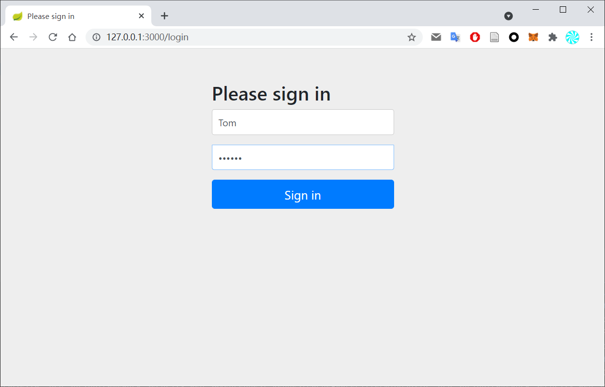
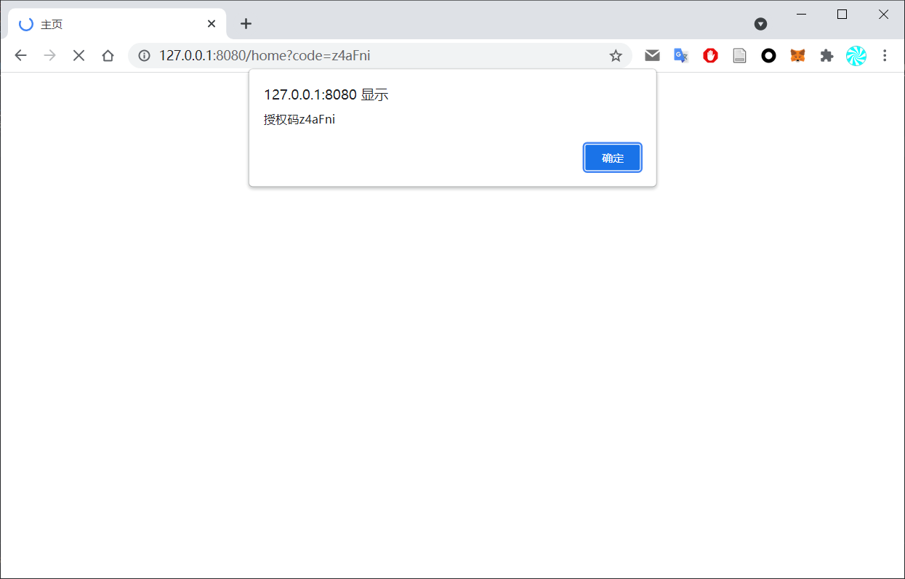
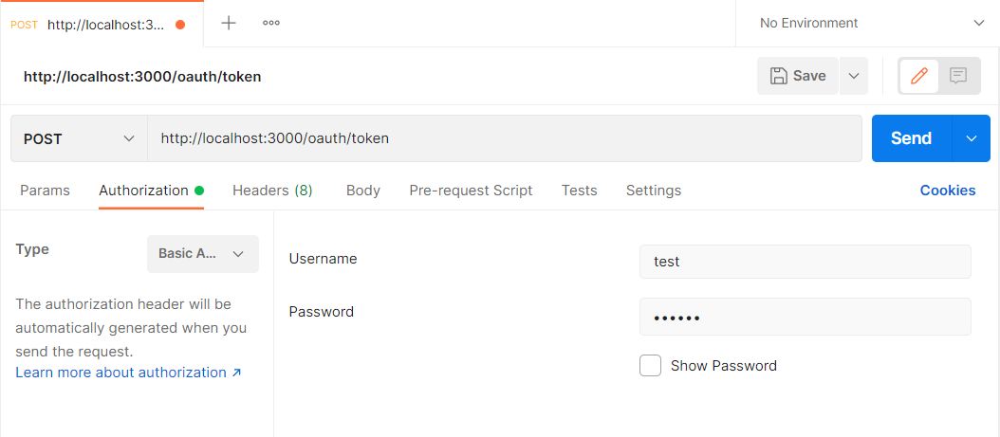
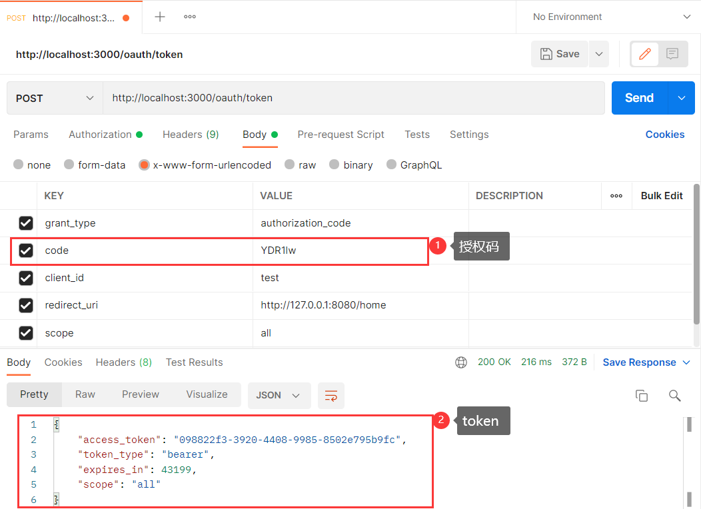
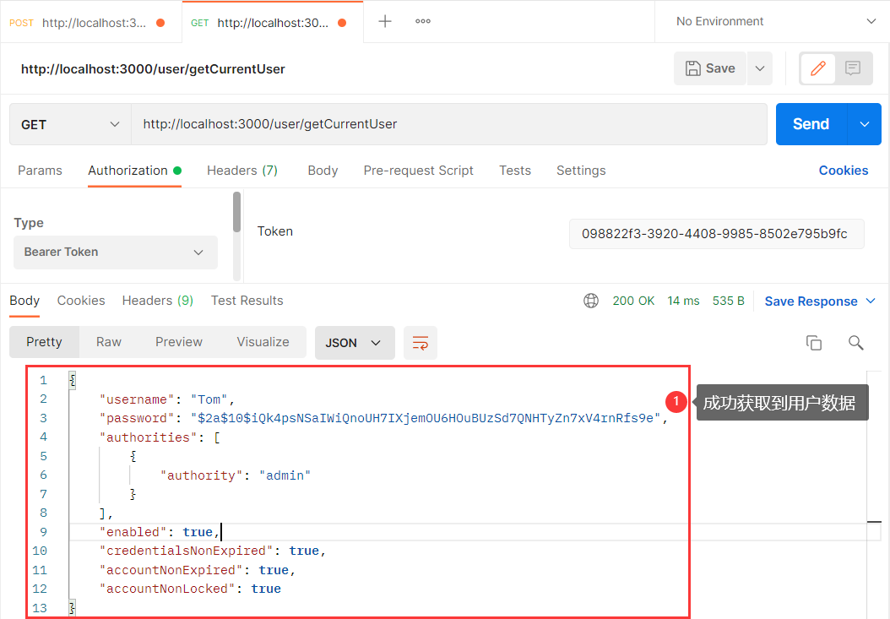

# OAuth2 实验
## 配置
### 授权服务器配置
```java
@Configuration
@EnableAuthorizationServer
public class AuthorizationServerConfig extends AuthorizationServerConfigurerAdapter {

    @Autowired
    private PasswordEncoder passwordEncoder;

    @Autowired
    private AuthenticationManager authenticationManager;

    @Autowired
    private UserService userService;

    /**
     * 使用密码模式需要配置
     */
    @Override
    public void configure(AuthorizationServerEndpointsConfigurer endpoints) {
        endpoints.authenticationManager(authenticationManager)
                .userDetailsService(userService);
    }

    @Override
    public void configure(ClientDetailsServiceConfigurer clients) throws Exception {
        clients.inMemory()
                // 配置client-id
                .withClient("test")
                // 配置client-secret
                .secret(passwordEncoder.encode("123456"))
                // 配置redirect_uri，用于授权成功后跳转
                .redirectUris("http://127.0.0.1:8080/home")
                // 配置申请的权限范围
                .scopes("all")
                // 配置授权类型：授权码模式和密码模式
                .authorizedGrantTypes("authorization_code", "password");
    }
}
```

### 资源服务器配置
```java
@Configuration
@EnableResourceServer
public class ResourceServerConfig extends ResourceServerConfigurerAdapter {

    @Override
    public void configure(HttpSecurity http) throws Exception {
        http.authorizeRequests()
                .anyRequest()
                .authenticated()
                .and()
                .requestMatchers()
                .antMatchers("/user/**")
                .and()
                .csrf()
                .disable();
    }
}
```


## 授权码模式流程
### 获取授权码

点击登录按钮访问如下链接可以进入OAth2认证服务的登录页面
```
http://127.0.0.1:3000/oauth/authorize?response_type=code&client_id=test&redirect_uri=http://127.0.0.1:8080/home&scope=all
```

输入用户名和密码登录后可以得到授权码


### 获取token
为了方便，这里使用postman发送post请求获取token，首先设置BASIC Authentication，用户名为client-id，密码为client-secret

然后添加表单数据，并发送请求即可获得token


### 获取授权数据
使用刚才拿到的token向资源服务器发起请求即可获取授权数据

